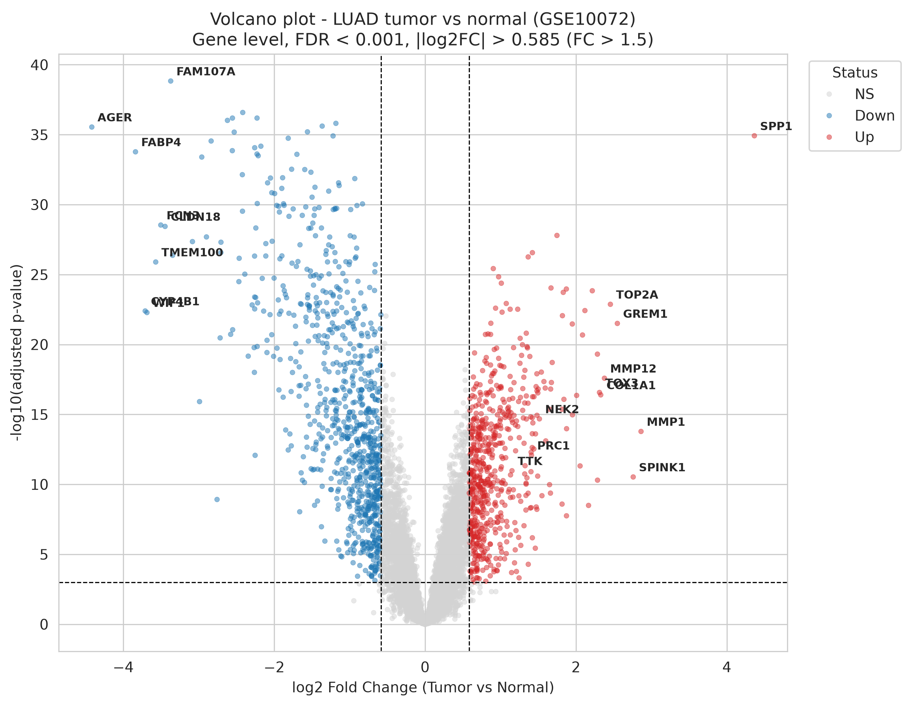

# Differential Expression Analysis of Lung Adenocarcinoma (GSE10072)

A reproducible, from-scratch differential expression (DE) analysis comparing lung adenocarcinoma (LUAD) tumor tissue with normal lung tissue, using the public microarray dataset **GSE10072**. The pipeline independently reproduces the headline cell-cycle gene signature reported in the original study, and recovers a coherent biological picture of tumor dedifferentiation and proliferation.

## Question

Which genes are differentially expressed between lung adenocarcinoma tumor tissue and adjacent normal lung tissue?

## Data

- **Source:** NCBI GEO, accession [GSE10072](https://www.ncbi.nlm.nih.gov/geo/query/acc.cgi?acc=GSE10072)
- **Platform:** Affymetrix HG-U133A (GPL96), 22,283 probes
- **Samples:** 107 (58 tumor, 49 normal)
- Expression values are log2-transformed and normalized, as provided by GEO.

Raw data files are **not** committed to this repository (they are large and publicly available). See [`data/README.md`](data/README.md) for download instructions.

## Methods

1. **Load & inspect** the GEO series matrix (22,283 probes x 107 samples).
2. **Assign groups** by parsing sample titles ("Lung Tumor" vs "Normal Lung") -> 58 tumor, 49 normal.
3. **Per-probe statistics:** independent two-sample t-test (tumor vs normal) for every probe. Log2 fold change is computed as the difference of group means (valid because the data is already on a log2 scale).
4. **Multiple-testing correction:** Benjamini-Hochberg FDR (`p_adj`).
5. **Probe -> gene mapping** using the GPL96 annotation table.
6. **Collapse to gene level:** for genes measured by multiple probes, keep the probe with the highest mean expression - a criterion independent of the test result, to avoid selection bias.
7. **Filter significant genes:** `FDR < 0.001` and `|log2FC| > 0.585` (fold change > 1.5), matching the thresholds used in the original paper.
8. **Visualize** with a labelled volcano plot.

## Results

**1,464 differentially expressed genes** were identified (625 up-regulated, 839 down-regulated in tumor).

### Down-regulated genes: loss of lung identity and metabolic capacity

**Alveolar differentiation markers.** The most strongly down-regulated genes include markers of the two principal alveolar epithelial cell types: *SFTPC* (alveolar type II cells) [1] and *AGER* (alveolar type I cells) [2]. Their concurrent loss is consistent with tumor tissue losing its differentiated alveolar character. Beyond acting as a differentiation marker, *SFTPC* has itself been reported to suppress epithelial-to-mesenchymal transition (EMT) via the SOX7-WNT/beta-catenin axis in NSCLC [1], suggesting its loss may be functionally relevant to tumor progression.

**Metabolic genes.** Several down-regulated genes are metabolic in nature - *FABP4* (lipid metabolism) and *ADH1B* (alcohol metabolism). Their reduction may point to diminished tissue metabolic capacity, though the present analysis provides no basis for stronger conclusions.

### Up-regulated genes: proliferation, invasion, and the tumor microenvironment

**Proliferation.** *TOP2A* is up-regulated, alongside the mitotic cell-cycle genes discussed below (*NEK2*, *TTK*, *PRC1*), together pointing to an active proliferative program.

**Invasion and matrix remodeling.** *MMP1*, the most highly expressed interstitial collagenase (degrading fibrillar collagen types I, II, III), is up-regulated; its overexpression in tumor tissue is associated with invasion and metastasis [3]. Fibrillar collagens (*COL11A1*, *COL10A1*, *COL1A1*) are also up-regulated, consistent with a desmoplastic stromal reaction.

**Tumor microenvironment (more nuanced).** *SPP1* (osteopontin) shows the largest increase (~20x). It is linked to invasion and to the tumor immune microenvironment, and is a marker of pro-tumor tumor-associated macrophages (TAMs) in LUAD [4]. *MMP12* (macrophage metalloelastase) is also up-regulated; its role in cancer is context-dependent, with both pro- and anti-tumor effects reported depending on cellular source, and it is predominantly macrophage-derived [5].

*Notably*, both *SPP1* and *COL11A1* are among the most strongly up-regulated genes. One study has reported that SPP1 promotes migration and invasion by targeting COL11A1 in LUAD [6]. Their co-upregulation here is **logically consistent** with that reported relationship, although a differential-expression analysis alone **cannot demonstrate** a direct regulatory interaction between them.

> **Observation (personal interpretation, not yet independently validated):** Several of the up-regulated genes - *SPP1*, *MMP12*, and in part *MMP1* - are known to be macrophage-derived. This raises the possibility that part of the increased bulk signal reflects macrophage infiltration into the tumor rather than changes within tumor cells alone. This is a hypothesis based on the known cellular sources of these genes, not a conclusion drawn directly from this analysis, and it would require single-cell or deconvolution methods to test.

### Independent reproduction of the original finding

The mitotic cell-cycle genes *NEK2*, *TTK*, and *PRC1* - the headline signature of the original study - were all recovered as significantly up-regulated with very small adjusted p-values. This serves as a positive control confirming the pipeline works.



### Extension: antigen presentation and the neoantigen question
 
Building on the macrophage-infiltration observation above, this extension asks a focused,
hypothesis-driven question in tumor immunology: **is the MHC class I antigen-presentation
machinery — the pathway that displays tumor neoantigens to CD8+ T cells — transcriptionally
altered in these tumors?** Loss of this machinery is a canonical route of immune escape, so
it is a natural thing to check. The analysis is a *targeted readout of a fixed gene panel*
([`antigen_presentation.ipynb`](notebooks/antigen_presentation.ipynb)), not a discovery
screen, and it deliberately includes immune-infiltrate reference genes so that any signal
in the panel can be interpreted against tissue composition (bulk tissue mixes tumor, stroma
and immune cells, and immune cells themselves express high MHC-I).
 
**Panel readout** (representative probe per gene; thresholds identical to the main analysis:
`FDR < 0.001` **and** `|log2FC| > 0.585`, i.e. fold change > 1.5x).
 
| Gene  | Module              | log2FC | p_adj  | Passes threshold?                   |
|-------|---------------------|-------:|-------:|-------------------------------------|
| HLA-A | MHC-I heavy chain   | -0.07  | 0.38   | no                                  |
| HLA-B | MHC-I heavy chain   | -0.16  | 0.053  | no                                  |
| HLA-C | MHC-I heavy chain   | -0.17  | 2.0e-3 | no                                  |
| B2M   | MHC-I light chain   | -0.20  | 3.6e-4 | no (passes FDR, fails effect size)  |
| TAP1  | Peptide transport   | +0.18  | 0.22   | no                                  |
| TAP2  | Peptide transport   | +0.17  | 0.037  | no                                  |
| TAPBP | Peptide loading     | +0.10  | 0.31   | no                                  |
| PSMB8 | Immunoproteasome    | +0.25  | 0.028  | no                                  |
| PSMB9 | Immunoproteasome    | +0.04  | 0.83   | no                                  |
| IRF1  | IFN-γ regulator     | -0.54  | 1.5e-5 | no (passes FDR, fails effect size)  |
| STAT1 | IFN-γ regulator     | +0.51  | 4.1e-5 | no (passes FDR, fails effect size)  |
 
Two genes could not be assessed: **NLRC5** (the master transcriptional activator of MHC-I)
and **CD68** (a macrophage marker) are not annotated on HG-U133A / were dropped during
gene-level collapse — NLRC5's MHC-I role was characterised (~2010) after this 2003 platform
was designed.
 
**No coordinated change of the presentation module.** None of the eleven measurable panel
genes clears the significance threshold. The strongest evidence that nothing coordinated is
happening is *per gene*: **every measurable gene has |log2FC| < 0.585** — no gene reaches the
1.5x effect-size bar, regardless of its p-value. Consistent with this, the panel does not
shift as a group (mean log2FC +0.01, median +0.04; 6 up, 5 down; a sign test does not reject
a 50/50 split, p = 1.0 — though with only eleven genes this test has low power and is a
secondary check, not the primary evidence). The two genes with the strongest *statistical*
signal are the interferon-γ transcription factors — **STAT1** (+0.51, p_adj 4e-5) and **IRF1**
(-0.54, p_adj 2e-5) — but both fall just short of the effect-size bar and, tellingly, move in
**opposite** directions rather than as a coordinated interferon program; the IFN-inducible
immunoproteasome subunits (PSMB8/PSMB9) are only trivially up. **B2M** reaches FDR
significance but with a negligible effect (-0.20). At the bulk-tissue level there is **no
evidence of MHC-I down-regulation** in this cohort.
 
(Note that "mean ≈ 0" alone would be a weak claim — large opposite-sign effects can average
to zero. What licenses "no meaningful change" is the *per-gene* result that no single
|log2FC| approaches the threshold.)
 
**Reference genes** (immune infiltrate / tissue composition — *not* part of the presentation
panel; included only to interpret it).
 
| Gene       | Role                          | log2FC | p_adj   | Reading                          |
|------------|-------------------------------|-------:|--------:|----------------------------------|
| CD8A       | Cytotoxic T cells             | -0.04  | 0.70    | flat (n.s.) — no CTL enrichment  |
| PTPRC/CD45 | Pan-leukocyte                 | -0.66  | 1.4e-4  | lower — total leukocytes diluted |
| SPP1       | Macrophage / TAM (proxy)      | +4.36  | 1.2e-35 | strongly up                      |
| MMP12      | Macrophage (proxy)            | +2.38  | 2.6e-18 | strongly up                      |
| MMP1       | Invasion / macrophage (proxy) | +2.86  | 1.7e-14 | strongly up                      |
 
(CD68, the canonical macrophage marker, is not on this platform — hence the SPP1/MMP proxy.)
 
**Reading against immune infiltrate.** The reference genes argue against dismissing the flat
panel as an infiltration artifact. The pan-leukocyte marker **PTPRC/CD45 is lower in tumor**
(-0.66, p_adj 1e-4) and the cytotoxic-T-cell marker **CD8A is flat** (-0.04, n.s.), so the
presentation panel is not being propped up by lymphocytic infiltration (which would *raise*
HLA/B2M). The lower PTPRC is best read as composition, not "less immune activity": normal
lung is leukocyte-rich, and tumor tissue dilutes that resident population as tumor cells take
up volume. Meanwhile the macrophage-associated genes from the main analysis are strongly up
(**SPP1 +4.36, MMP12 +2.38, MMP1 +2.86**; a proxy, since bulk data cannot prove which cells
express them). The coherent reading is a **shift in immune composition** — loss of the
leukocyte-rich normal-lung milieu, gain of a specific pro-tumor macrophage program — rather
than a T-cell-inflamed, interferon-high state. This is consistent with, and extends, the
macrophage-infiltration observation noted earlier.
 
**Interpretation through the neoantigen / CD8 lens.** That the presentation machinery is
transcriptionally intact means there is no evidence, at the tissue level, that these tumors
have silenced their *capacity* to present neoantigens — a genuinely informative negative. But
it must be read with three hard limits, each of which is a reason bulk expression is the wrong
tool for the neoantigen-presentation question:
 
- **Bulk != tumor-cell-specific.** Stromal and immune cells express high MHC-I; a tumor-cell-
  intrinsic HLA loss can be entirely masked in bulk by MHC-I-high non-tumor cells. "Bulk MHC-I
  preserved" therefore does **not** establish that tumor cells present neoantigens.
- **mRNA != surface protein or function.** The dominant real-world routes of antigen-
  presentation loss in lung cancer are **genomic and proteomic** — allele-specific **HLA loss
  of heterozygosity** [7] and **B2M** truncating mutation [8] — and are invisible to an
  expression microarray, which measures only transcript abundance (the remaining allele is
  still transcribed; a mutated transcript is still counted).
- **Weak effector signal.** With CD8A flat and no coordinated interferon signature, this looks
  closer to an immune-excluded ("cold") phenotype than an inflamed one; escape here, if
  present, is more plausibly immune exclusion or antigen-specific/genomic than transcriptional
  MHC-I silencing.
The honest conclusion is a **complex negative**: the antigen-presentation machinery is
transcriptionally intact at the bulk level, the measurable immune signal is macrophage- rather
than T-cell-driven, and the mechanisms most relevant to neoantigen presentation cannot be
resolved with this data type. Answering the question requires single-cell / tumor-cell-
resolved expression to separate tumor from stroma, and paired genomic HLA-typing and
mutation-calling (ideally multi-region, so a loss event can be placed as clonal/early vs
subclonal/late) to detect the HLA-LOH and B2M routes that expression cannot see — the
direction this project builds toward.

## How to reproduce

```bash
# 1. Create the environment
conda env create -f environment.yml
conda activate pybio

# 2. Download the data (see data/README.md) into data/

# 3. Run the notebook
jupyter lab notebooks/luad_analysis.ipynb
```

Then run **Kernel -> Restart Kernel and Run All Cells** to reproduce every result from scratch.

## Limitations

This project is a methods demonstration and reproduction, **not** a claim of novel biomarker discovery. Several simplifications are worth stating explicitly:

- **No confounder adjustment.** A simple t-test was used, whereas the original study used ANOVA adjusting for confounders (age, sex, smoking status). Because tumor/normal status is entangled with these variables, the unadjusted test likely inflates the number of significant genes.
- **Paired design not exploited.** Tumor and normal samples were taken from the same patients, but an independent (unpaired) t-test was used, which is less statistically powerful than a paired approach.
- **Cell-composition confounding.** Strong down-regulation of lung-specific genes (e.g. *SFTPC*, *AGER*) may partly reflect differences in cell-type composition between tumor and normal tissue (fewer alveolar cells in tumor), rather than per-cell transcriptional changes. The same caveat applies to the macrophage-derived up-regulated genes noted above. Bulk expression data cannot distinguish these possibilities.
- **One probe per gene.** For multi-probe genes, only the highest-expressed probe was retained; multi-gene probes were dropped.
- **Statistical vs biological significance.** With n = 107, many very small differences reach statistical significance; effect-size filtering (fold change > 1.5), not p-value alone, does the real work of selecting meaningful genes.
- **The antigen-presentation panel is platform-limited.** NLRC5 (the master MHC-I
  transactivator) and CD68 are not annotated on HG-U133A, so the panel is incomplete on both
  the regulatory and the macrophage-marker sides.
- **HLA class I probes cross-hybridise.** The only HG-U133A probe sets for HLA-A/B/C are
  Affymetrix `_x_at` sets, flagged for cross-hybridisation; because HLA-A/B/C are highly
  homologous, their individual values are unreliable and cannot be cleanly separated from one
  another.
- **Expression cannot detect genomic/proteomic immune escape.** HLA loss of heterozygosity and
  B2M mutation — routes that dominate immune evasion in lung adenocarcinoma — are undetectable
  by expression microarray, so a "normal" MHC-I transcript profile does not exclude functional
  loss of presentation.

## Future work

- **Confounder-adjusted model (R):** fit a multiple linear regression per gene (`expression ~ tumor + smoking + age + sex`) to isolate the tumor effect from clinical confounders - directly addressing the first limitation above.
- **Diagnostic modelling (R):** logistic regression with ROC/AUC to assess how well candidate genes discriminate tumor from normal.
- **Survival analysis (R):** Kaplan-Meier and Cox proportional-hazards models, if clinical outcome data can be linked.

These extensions will be added to this repository as a second analysis stage.

## Repository structure

```
├── notebooks/luad_analysis.ipynb   # full Python analysis
├── figures/                        # volcano plot (PNG + PDF)
├── results/                        # DEG tables (CSV)
├── data/README.md                  # data download instructions
├── environment.yml                 # conda environment
└── .gitignore
```

## References

1. Zhang Q, An N, Liu Y, et al. Alveolar type 2 cells marker gene SFTPC inhibits epithelial-to-mesenchymal transition by upregulating SOX7 and suppressing WNT/beta-catenin pathway in non-small cell lung cancer. *Front Oncol*. 2024;14:1448379.
2. AGER (RAGE) is an established marker of alveolar type I cells; its expression is restricted to type I pneumocytes by immunohistochemistry (see e.g. Shirasawa M, et al. Receptor for advanced glycation end-products is a marker of type I lung alveolar cells. *Genes Cells*. 2004;9(2):165-174).
3. Sauter W, Rosenberger A, Beckmann L, et al. Matrix metalloproteinase 1 (MMP1) is associated with early-onset lung cancer. *Cancer Epidemiol Biomarkers Prev*. 2008;17(5):1127-1135.
4. Matsubara E, Komohara Y, Esumi S, et al. SPP1 derived from macrophages is associated with a worse clinical course and chemo-resistance in lung adenocarcinoma. *Cancers (Basel)*. 2022;14(18):4374. doi:10.3390/cancers14184374.
5. Lv FZ, Wang JL, Wu Y, Chen HF, Shen XY. Knockdown of MMP12 inhibits the growth and invasion of lung adenocarcinoma cells. *Int J Immunopathol Pharmacol*. 2015;28(1):77-84. doi:10.1177/0394632015572557. (See also reviews on the context-dependent, macrophage-derived roles of MMP12 in cancer.)
6. Yi X, Luo L, Zhu Y, et al. SPP1 facilitates cell migration and invasion by targeting COL11A1 in lung adenocarcinoma. *Cancer Cell Int*. 2022;22:324. doi:10.1186/s12935-022-02749-x.
7. McGranahan N, Rosenthal R, Hiley CT, et al. Allele-specific HLA loss and immune escape in lung cancer evolution. *Cell*. 2017;171(6):1259-1271.e11. doi:10.1016/j.cell.2017.10.001.
8. Zaretsky JM, Garcia-Diaz A, Shin DS, et al. Mutations associated with acquired resistance to PD-1 blockade in melanoma. *N Engl J Med*. 2016;375(9):819-829. doi:10.1056/NEJMoa1604958.
9. Meissner TB, Li A, Biswas A, et al. NLR family member NLRC5 is a transcriptional regulator of MHC class I genes. *Proc Natl Acad Sci USA*. 2010;107(31):13794-13799. doi:10.1073/pnas.1008684107.

## Acknowledgements

Data from Landi MT, Dracheva T, Rotunno M, et al. *Gene expression signature of cigarette smoking and its role in lung adenocarcinoma development and survival.* PLoS ONE. 2008;3(2):e1651. doi:10.1371/journal.pone.0001651 (GEO: GSE10072).

This repository is an independent reanalysis carried out for learning purposes.
## Related work

[hla-kinh-reanalysis](https://github.com/dkhoi2505/hla-kinh-reanalysis) — HLA class I typing from targeted amplicon data in a Vietnamese cohort, and the reference-construction limits that constrain it.
